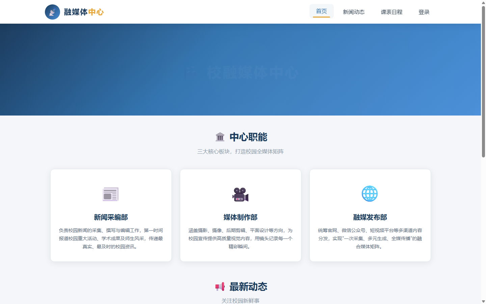

# 🏫 校融媒体中心门户网站

[](https://developer.mozilla.org/zh-CN/docs/Web/HTML)
[](https://developer.mozilla.org/zh-CN/docs/Web/CSS)
[](LICENSE)

**融合校园媒体力量 · 传播青春正能量 · 讲好校园故事**

一个面向学校融媒体中心的品牌形象门户网站。采用纯 **HTML5 + CSS3** 技术栈构建，使用语义化标签、Flex 布局、CSS3 动画与过渡，实现了美观、响应式的多页面展示。

---

## 📖 项目背景

校融媒体中心是整合校园新闻采编、媒体制作、融媒发布于一体的学生组织。本项目旨在为中心搭建一个对外展示品牌形象、对内提供信息服务的门户网站，涵盖中心介绍、新闻动态、值班课表和成员登录等核心功能。

---

## 🗂️ 项目结构

```
xhs-SchoolMedia/
├── index.html          # 首页 — 中心简介、职能展示、最新动态
├── news.html           # 新闻动态 — 头条新闻、全部新闻列表
├── schedule.html       # 课表日程 — 值班表、近期日程
├── login.html          # 成员登录 — 内部管理系统入口
├── css/
│   └── style.css       # 全局样式表（CSS 变量、Flex 布局、动画、响应式）
├── screenshot.png      # 网站预览截图
├── README.md           # 本文件
└── LICENSE             # MIT 开源许可协议
```

---

## ✨ 页面一览

### 📄 首页（index.html）

中心品牌形象展示页，包含：
- **通栏 Banner** — 渐变背景 + 动态光晕动画
- **三职能卡片** — 新闻采编部、媒体制作部、融媒发布部，Flex 三栏布局
- **最新动态** — 带日期标签的新闻列表

### 📰 新闻动态（news.html）

展示中心的最新资讯，包含：
- **头条新闻** — 置顶重要消息
- **全部新闻** — 按时间倒序排列的文章列表，支持分类标签（头条/活动/公告/融媒/技术）

### 🗓️ 课表日程（schedule.html）

融媒体中心值班安排，包含：
- **值班课表** — 完整的 `thead / tbody / tfoot` 语义表格，使用 `colspan` / `rowspan` 合并行列
- **近期日程** — 培训、团建、招新等事件清单

### 🔐 成员登录（login.html）

内部管理系统登录入口，包含：
- **登录表单** — `label` 与 `input` 的 `for/id` 关联
- **用户名 & 密码**输入框

---

## 🎨 技术特色

### ✅ HTML5 语义化
- `<header>`、`<nav>`、`<main>`、`<section>`、`<article>`、`<footer>` 等语义标签
- `<thead>` / `<tbody>` / `<tfoot>` 表格语义结构
- `colspan` / `rowspan` 跨行跨列合并

### ✅ CSS3 特性
- **CSS 变量（自定义属性）** — 统一管理主题色、阴影、圆角等
- **Flex 布局** — 导航栏、卡片网格、页脚均使用 Flex
- **CSS3 动画** — Logo 呼吸脉冲、Banner 背景光晕旋转、标题淡入上浮、卡片图标悬浮
- **CSS3 过渡** — 导航下划线滑入、卡片悬停上浮、输入框聚焦高亮、按钮渐变
- **伪类应用** — `:hover`、`:focus`、`:active`、`::placeholder`、`:nth-child`
- **渐变背景** — 线性渐变 `linear-gradient`

### ✅ 响应式设计
- 屏幕宽度 ≤ 768px 时自动适配移动端
- 导航栏堆叠、卡片纵向排列、表格横向滚动

### ✅ 代码分离
- 所有样式集中在外部的 `css/style.css`，结构与样式解耦

---

## 🚀 快速开始

本项目为纯静态网站，无需构建工具或后端服务。

```bash
# 克隆仓库
git clone https://github.com/March7th-OvO/zy1.git

# 直接用浏览器打开首页
open index.html     # macOS
start index.html    # Windows
```

或者使用 VS Code 的 **Live Server** 插件进行本地预览。

---

## 🖼️ 预览



---

## 📄 许可证

本项目基于 [MIT License](LICENSE) 开源。

---

<p align="center">❤️ 制作：融媒体中心技术部</p>
